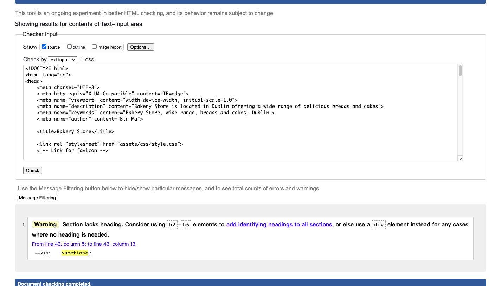

# Bakery Store
(Developer: Bin Ma)

[Live webpage](https://4n4ru.github.io/CI_MS1_BodelschwingherHof/)

## Table of Content

1. [Project Goals](#project-goals)
    1. [User Goals](#user-goals)
    2. [Site Owner Goals](#site-owner-goals)
2. [User Experience](#user-experience)
    1. [Target Customer](#target-customer)
    2. [User Requrements and Expectations](#user-requrements-and-expectations)
    3. [User Stories](#user-stories)
3. [Design](#design)
    1. [Design Choices](#design-choices)
    2. [Colour](#colours)
    3. [Fonts](#fonts)
    4. [Structure](#structure)
4. [Technologies Used](#technologies-used)
    1. [Languages](#languages)
    2. [Frameworks & Tools](#frameworks-&-tools)
5. [Features](#features)
6. [Testing](#validation)
    1. [HTML Validation](#HTML-validation)
    2. [CSS Validation](#CSS-validation)
    3. [Performance](#performance)
7. [Bugs](#Bugs)
8. [Deployment](#deployment)
9. [Credits](#credits)
10. [Acknowledgements](#acknowledgements)

## Project Goals 

### User Goals
- Finding a bakery store that offers a nice atmosphere and good sweets.
- See a vareity of choices with clear images.
- Find information about the bakery store.
- Find the location of the our store.

### Site Owner Goals
- Increase in the number of customers.
- Promote the business.
- Provide a way for new and existing customers to contact the business.
- Render essential information about the business to customers.

## User Experience

### Target Customer
- People looking for a place to find delicious sweets.
- People looking to order take away.
- Groups of people looking for a place where they can sit down to have a chat.
- Offer a place that people can connect internet to work or study.

### User Requrements and Expectations

- A simple and clear navigation system.
- Quickly and easily to find useful information.
- Links and functions that work as expected.
- Good presentation and a visually appealing design regardless of screen size.
- An easy way to contact store.
- Simple content that the user can understand easily.
- Accessibility.

### User Stories

#### First-time User 
1. As a first time user, I want to know where the bakery store is located.
2. As a first time user, I want to know what type of products are included.
3. As a first time user, I want to know what daily selection is.
4. As a first time user, I want to show how I feel after visiting the store.

#### Returning User
5. As a returning user, I want to see the daily-special product in store.
6. As a returnign user, I want to know the opening time of store.
7. As a returning user, I want to find phone number to make a reservation.
8. As a returning user, I want to leave some comments, suggestions or messages to store.

#### Store Owner 
9. As the store owner, I want users to find news about upcoming events or changes in opening time.
10. As the store owner, I want users to get to know the latest product launched. 
11. As the store owner, I want the users to be able to contact us.

## Design

### Design Choices
The webpage was designed for customers feeling personally on the scences. It is attractive and impressive. Plenty of the images on the page showed exactly what products have in store.

### Color
For the colour design warm grey tones that is luxurious and elegant were chosen to match the images on the page and also the colour theme of the actual bakery store. To narrow down the colours I used Adobe Color which assists me with better vision feeling.
 

### Fonts
For consistency the webpage was designed by importing Lato and sans-serif font style which follows love-running project.
 
Lato and sans-serif look like simple, clean and friendly to website user.

### Structure
The page is structured in a well-known, recognizable, user friendly, and easy-to-learn way. Users will see a familiar type of navigation bar with bakery store logo on the left side and the navigation links on the other side when customers first come to our website. 
The website consists of five separate pages: 
- Homepage with latest infomation about store and Sunday special offers.
- Cake page includes various birthday cakes for customers.
- Bread page provides wide range of choices to meet the needs of all.
- Contact page with a contact form that can collect feedback from customers, which helps store to improve service quailty.
- Thank-you page would like to give users who left their real thinking a sincere thanks.

## Technologies Used

### Languages
- HTML
- CSS

### Frameworks & Tools
- Git
- GitHub
- Gitpod
- Google Fonts
- Adobe Color
- Font Awsome
- Favicon.io

## Features
The page consists of five pages

### Logo and Navigation Bar

- To provide the user with simple and clean navigation across all five pages, the header includes the navigation bar at the top right hand and the logo ‘Sweet I♥ve’ with lovely red color on the top left corner, which creates some space in between both, as well as making it clear on first sight what the site is about and where the navigation can be found. The navigation bar includes Homepage, Cake, Bread and Contact page.
- The navbar is fully responsive and changes to a toggler (hamburger menu) on smaller screens and includes clickable links to relevant page.
- The link for the page the user is currently on is highlighted by underline.

### Carousel
- Provides customers with the most direct visual experience about star products in store.
- Options for the user to navigate the slide show by using indicators at the bottom of carousel.

### Dashboard
- Allow users to know upcoming events or any news about bakery store.

### Daily special
- Allow users to see what special product is available for fllowing Sunday.
- It will update every day which allows customers pick up their best choice.

### Footer
- Featured on all four pages
- Consists of three seperate sections: location, useful information including about-us, help-center, customer service and opening. And lastly store can be followed by popular social media.

### Cake
- Give an overview of cake products which allows customer to select their favourite cake.
- Each line is accompanied with an image and its name.
- Small heart allows customers to add cakes on wishlist.

### Bread
- Detailed bread list meet the requirements of all needs.
- Clear images and name give customers deep impression.
- Wishlist can be built via clickable herat for future purchase.

### Thank You
- Upon submitting the form the user will be redirected to a new page, which will thank them for signing up 
- If they left a comment someone will respond within 48 hrs. No user information will be stored.

## Validation

### HTML Validation
The W3C Markup Validation Service was used to validate the HTML of the website. There is no errors found across all five pages. 

Homepage

Cake

Bread

Contact-Us

Thank-You

### CSS Validation
The W3C Jigsaw CSS Validation Service was used to validate CSS of the website.
There was no error found on CSS file.

style.css

### Performance 
Google Lighthouse in Google Chrome Developer Tools was used to test the performance of the website. The page achieved great performance on desktop and mobile.

Desktop

Mobile

## Bugs

- Flex box can disable position: fixed on header. Fixed: Add an extra container nest header and define the outer container position: fixed.
- The user can submit a contact form input without a message. Fixed: Add required attribute to message input field 
- Narrow down screen cause white space on the right side. Fixed: Add overflow-x: hidden to w container.

## Deployment
The website was deployed using GitHub Pages by following these steps:
1. Navigate to the Settings tab in GitHub repository 
2. Select Pages on the left side hand
3. Select Branch: master for the source 
4. After the webpage refreshes automaticaly you will se a ribbon on the top saying: "Your site is published at https://mabin9527.github.io/Bakery-Store/"

## Credits

### Media

- [Slider1](assets/images/Slider1.jpg): Photo by <a href="https://www.pexels.com/photo/cake-chocolate-cream-crepe-264939/">Pixabay</a> on <a href="https://www.pexels.com/zh-cn/search/cake/">Pexels</a>
- [Slider2](assets/images/Slider2.jpg): Photo by <a href="https://www.pexels.com/photo/photo-of-cake-2928378/">Cats Coming</a> on <a href="https://www.pexels.com/zh-cn/search/cake/">Pexels</a>
- [Slider3](assets/images/Slider3.jpg): Photo by <a href="https://www.pexels.com/photo/shallow-focus-photo-of-sliced-cake-on-black-ceramic-tray-1860203/">Valeria Boltneva</a> on <a href="https://www.pexels.com/zh-cn/search/cake/">Pexels</a>
- [Slider4](assets/images/Slider4.jpg): Photo by <a href="https://www.pexels.com/photo/sliced-cake-on-plate-291528/">Abhinav Goswami</a> on <a href="https://www.pexels.com/zh-cn/search/cake/">Pexels</a>
- [Dashborard1](assets/images/Dashboard1.jpg): Photo by <a href="https://www.pexels.com/photo/cake-decorated-with-berries-4686833/">cottonbro studio</a> on <a href="https://www.pexels.com/zh-cn/search/cake/">Pexels</a>
- [Special](assets/images/Special.jpg): Photo by <a href="https://www.pexels.com/photo/berries-blueberries-cake-cream-236804/">Pixabay</a> on <a href="https://www.pexels.com/zh-cn/search/cake/">Pexels</a>
- [red-velvet-cake](assets/images/red-velvet-cake.jpeg): Photo from <a href="https://thenaturalbakery.ie/product-category/cakes/"> The Natural Bakery </a>
- [oreo-cake](assets/images/oreo-cake.jpeg): Photo from <a href="https://thenaturalbakery.ie/product-category/cakes/"> The Natural Bakery </a>
- [coffee-birthday-cake](assets/images/coffee-birthday-cake.jpeg): Photo from <a href="https://thenaturalbakery.ie/product-category/cakes/"> The Natural Bakery </a>
- [vanilla-buttercream](assets/images/vanilla-buttercream.jpeg): Photo from <a href="https://thenaturalbakery.ie/product-category/cakes/"> The Natural Bakery </a>
- [biscoff-cake](assets/images/biscoff-cake.jpeg): Photo from <a href="https://thenaturalbakery.ie/product-category/cakes/"> The Natural Bakery </a>
- [black-forest-cake](assets/images/black-forest-cake.jpeg): Photo from <a href="https://thenaturalbakery.ie/product-category/cakes/"> The Natural Bakery </a>
- [happy-birthday-cake](assets/images/happy-birthday-cake.jpeg): Photo from <a href="https://thenaturalbakery.ie/product-category/cakes/"> The Natural Bakery </a>
- [kinder-bueno-cake](assets/images/kinder-bueno-cake.jpeg): Photo from <a href="https://thenaturalbakery.ie/product-category/cakes/"> The Natural Bakery </a>
- [Guinness-Bread](assets/images/Guinness-Bread.jpeg): Photo from <a href="https://thenaturalbakery.ie/product-category/breads/"> The Natural Bakery </a>
- [Large-Honey-Spelt](assets/images/Large-Honey-spelt.jpeg): Photo from <a href="https://thenaturalbakery.ie/product-category/breads/"> The Natural Bakery </a>
- [Large-Multigrain-Pan](assets/images/Large-Multigrain-Pan.jpeg): Photo from <a href="https://thenaturalbakery.ie/product-category/breads/"> The Natural Bakery </a>
- [Large-White-Pan](assets/images/Large-White-Pan.jpeg): Photo from <a href="https://thenaturalbakery.ie/product-category/breads/"> The Natural Bakery </a>
- [Sourdough](assets/images/Sourdough.jpeg): Photo from <a href="https://thenaturalbakery.ie/product-category/breads/"> The Natural Bakery </a>
- [White-Turnover](assets/images/White-Turnover.jpeg): Photo from <a href="https://thenaturalbakery.ie/product-category/breads/"> The Natural Bakery </a>
- [Wholemeal-Pan](assets/images/Wholemeal-Pan.jpeg): Photo from <a href="https://thenaturalbakery.ie/product-category/breads/"> The Natural Bakery </a>
- [Round-Brown-Soda](assets/images/Round-Brown-Soda.jpeg): Photo from <a href="https://thenaturalbakery.ie/product-category/breads/"> The Natural Bakery </a>
- [bg-image](assets/images/bg-image.jpg): Photo by <a href="https://www.pexels.com/photo/shallow-focus-photography-of-chocolate-cupcakes-1028714/">Acharaporn Kamornboonyarush</a> on <a href="https://www.pexels.com/zh-cn/search/cake/">Pexels</a>

### Code

Part of CSS code for carousel was referenced form cloud.tencent.com article no.1774625, which is clean and powerful.

## Acknowledgements

There were many chanllenges ahead of me when I digged into my first project. I was struggled with complicated webpages when I try different media query. Here I want to thank my mentor Martina who suggested me to remove some complex and unnecessary contents, which helps me a lot. Besides, efficient and sufficient feedback supported me to finish project 1.

